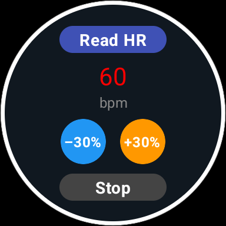
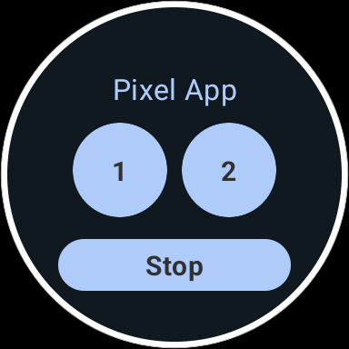

<p align="center">
  
</p>

# ❤️🔄 HeartLoop

HeartLoop is a **Wear OS application** that measures the user's heart rate and provides **haptic biofeedback** through vibrations.  

This app was developed as an **improved version** of the application created during my **Master’s thesis research**.  
- 🧪 The **thesis version** was a prototype built with a **constant BPM value defined at build time**, since it did not yet support real-time HR sensor readings.  
- 🚀 **HeartLoop** extends that work by integrating the **watch’s heart rate sensor**, allowing true real-time biofeedback at ±30% of the user’s actual BPM.  

The principle behind both versions remains the same: **biofeedback can influence arousal and affect the way we feel and perform tasks**.  
By vibrating at **–30%** or **+30%** of the user’s heart rate, HeartLoop lets users experience how different rhythms can change body perception, arousal levels, and potentially influence performance in motor or cognitive tasks.  


---

## ✨ Features
- 📊 **Heart Rate Measurement** — read the user’s current BPM directly from the smartwatch sensor.  
- 🔄 **Biofeedback Vibrations** — generate vibration patterns synced to:  
  - **–30% HR** → slower rhythm, induces relaxation / lower arousal.  
  - **+30% HR** → faster rhythm, induces stimulation / higher arousal.  
- ⏹️ **Stop Button** — cancel feedback anytime.  
- 🎨 **Optimized UI** — round-friendly design with custom splash screen & icon.  
- 🧪 **Research-driven** — based on the Yerkes-Dodson law and prior experiments in XR/biofeedback.  

---

## 🖼️ App UI
| Screen | Description |
|--------|-------------|
|  | Main screen showing current BPM, ±30% vibration buttons, and stop button. |
|  | Version of the watch face used during the thesis. |

---

## 🎛️ Button Guide
- **Read HR** → Reads the current heart rate once and displays it on screen.  
- **–30%** → Starts vibration feedback at 30% slower than your HR (relaxation).  
- **+30%** → Starts vibration feedback at 30% faster than your HR (stimulation).  
- **Stop** → Stops any ongoing vibration immediately.  

---

## 🧑‍🔬 Research Background
This app is based on my thesis work exploring the **influence of biofeedback-driven arousal** on task performance.  
The ±30% values are not arbitrary: they were chosen because they create clear subjective perception of a “slower” or “faster” heartbeat rhythm.  

- **–30% condition** → promotes **low arousal**, which in experiments improved simple motor stability tasks.  
- **+30% condition** → promotes **high arousal**, which in experiments challenged performance in complex dual tasks.  

HeartLoop is a compact, real-world extension of that idea — letting anyone feel how their body reacts to altered heartbeat feedback.  

---

## 🛠️ Tech
- Kotlin  
- Jetpack Compose for Wear OS  
- Android Sensor API (`Sensor.TYPE_HEART_RATE`)  
- Adaptive Icons + SplashScreen API  

---

## 🚀 Getting Started
1. Clone the repo:
   ```bash
   git clone https://github.com/YOUR_USERNAME/heartloop-wearos.git
   ```
2. Open in Android Studio (latest).  
3. Build & run on a Wear OS device or emulator with HR sensor support.  

---

## 👤 Author
Developed by **João Vaz**  
📧 [joao.lmr.vaz@gmail.com]  


---

## 📜 License
MIT — feel free to modify and experiment, but please credit this repo if you build on it.  
